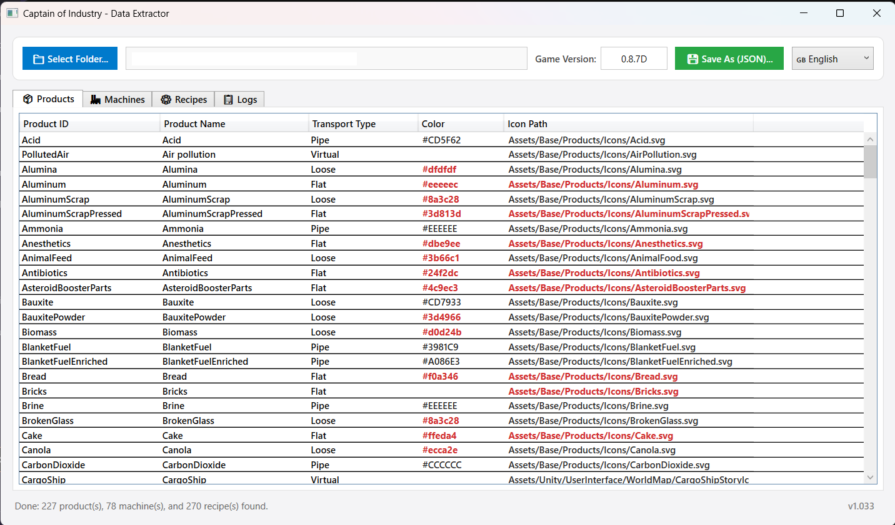
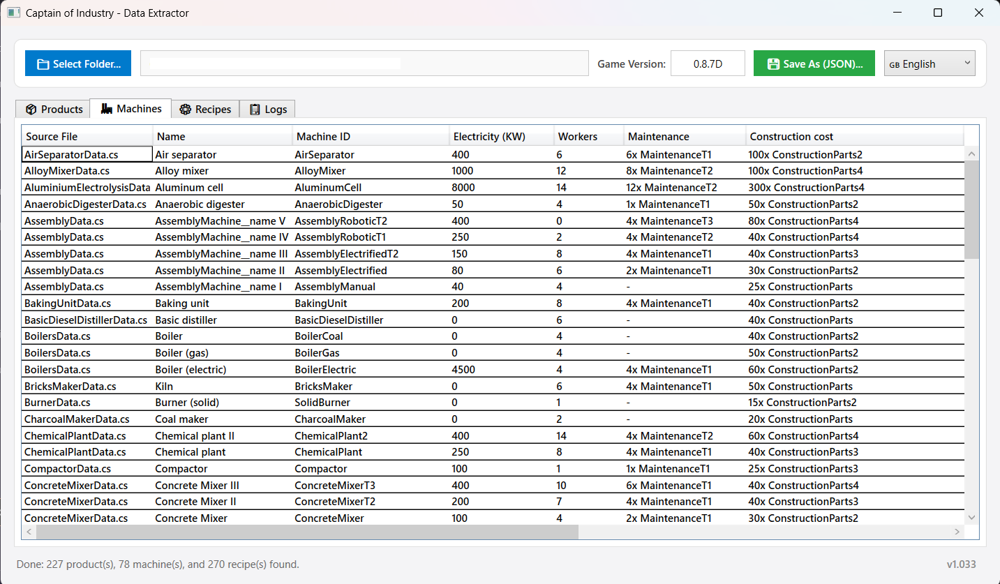
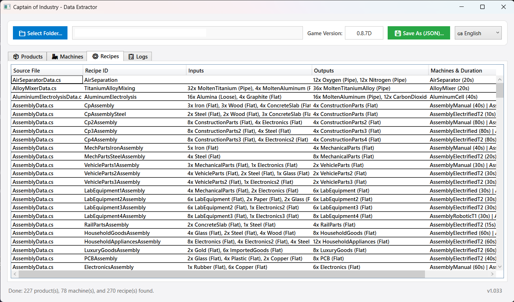
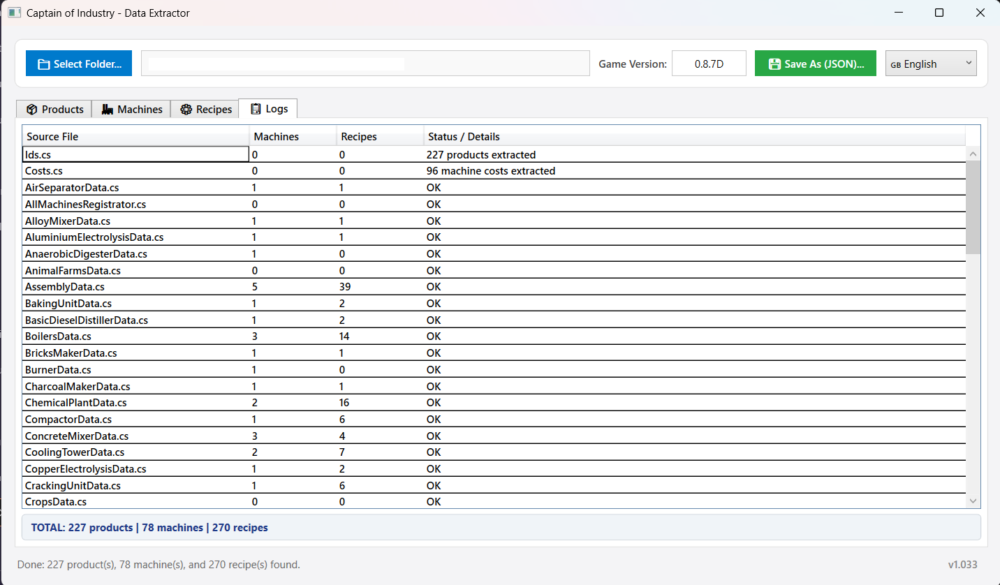

# CoiDataExtractor

[](https://opensource.org/licenses/MIT)
[](https://dotnet.microsoft.com/)

**CoiDataExtractor** is a lightweight WPF utility designed to parse and extract prototypes (Products, Machines, and Recipes) from the decompiled C# source files of the game **Captain of Industry**, exporting clean and structured JSON files for calculators, wiki pages, or automation tools.

---

## 📸 Screenshots

### Application Interface






---

## ✨ Features

- **Products Extraction:** Resolves IDs, display names, transport/conveyor types (Flat, Loose, Pipe, Virtual), icons, and color hex codes.
- **Color Fallback:** Integrates fallback color definitions (`resources.json`) for products lacking hardcoded RGB data.
- **Machines Extraction:** Extracts identifiers, localized titles, descriptions, next-tier bindings, prefab paths, power/electricity consumption (kW/MW), and required Workers.
- **Recipes Parsing:** Accurately extracts inputs, outputs, port assignments, operational durations, and bound machines. Fully supports dynamic local variables for input/output quantities.
- **Multi-language Support:** Native interface in English with on-the-fly French language switching.

---

## 🛠️ Required Game Files

Because game assets and decompiled code cannot be redistributed, you must extract the prototype files from your own copy of **Captain of Industry** using a decompiler such as [ILSpy](https://github.com/icsharpcode/ILSpy) or [dnSpy](https://github.com/dnSpy/dnSpy).

Decompile `Mafi.Base.dll` and export the following source files into a folder:

1. **`\mafi.base\Mafi.Base\Ids.cs`** *(Mandatory — provides all internal product definitions and IDs)*
2. **`\mafi.base\Mafi.Base\Costs.cs`** *(Mandatory — provides machine worker counts and costs)*
3. **All `.cs` files inside `\mafi.base\Mafi.Base.Prototypes.Machines\`** *(e.g., `FurnacesData.cs`, `AssemblyData.cs`, `ConcreteMixerData.cs`, `AirSeparatorData.cs`...)*

> **Note:** The application automatically verifies the presence of both **`Ids.cs`** and **`Costs.cs`**. If either file is missing from the selected directory (or its subdirectories), analysis will be aborted with a notification prompt.

---

## 🚀 How to Use

1. Launch **CoiDataExtractor.exe**.
2. Click **📁 Select Folder...** and browse to the folder containing your extracted `.cs` files.
3. Inspect and verify the extracted data across the three tabs: **Products**, **Machines**, and **Recipes**.
4. Set the corresponding **Game Version** (e.g., `0.8.7D`) in the top bar.
5. Click **💾 Save As (JSON)...** to save your structured `captain_of_industry_data.json` file.

---

## 📄 JSON Export Format

The output JSON contains clean, ready-to-use lists. Recipe entries keep only essential references (`Quantity` and `ProductId`) while referencing the master `Products` catalog:

```json
{
  "_generator": "CoiDataExtractor v1.02",
  "_repository": "[https://github.com/Raph42/CoiDataExtractor](https://github.com/Raph42/CoiDataExtractor)",
  "_license": "MIT License ([https://opensource.org/licenses/MIT](https://opensource.org/licenses/MIT))",
  "_notice": "Generated automatically from Captain of Industry game files.",
  "gameVersion": "0.8.7D",
  "Products": [
    {
      "Id": "BauxitePowder",
      "Name": "Bauxite Powder",
      "TransportType": "Loose",
      "Color": "#3d4966",
      "IconPath": "Assets/Base/Products/Icons/BauxitePowder.svg"
    }
  ],
  "Machines": [
    {
      "Id": "ConcreteMixerT2",
      "Name": "Concrete Mixer II",
      "Description": "High-powered mixer that creates concrete. Also provides alternative recipes for concrete.",
      "ElectricityConsumption": "200 kW",
      "Workers": 4,
      "IconOrPrefab": "Assets/Base/Machines/Infrastructure/ConcreteMixerT2.prefab",
      "NextTierId": "ConcreteMixerT3"
    }
  ],
  "Recipes": [
    {
      "RecipeId": "ConcreteMixingSlag",
      "Inputs": [
        { "Quantity": 1, "ProductId": "Cement" },
        { "Quantity": 2, "ProductId": "Sand" },
        { "Quantity": 6, "ProductId": "SlagCrushed" },
        { "Quantity": 4, "ProductId": "Water" }
      ],
      "Outputs": [
        { "Quantity": 8, "ProductId": "ConcreteSlab" }
      ],
      "MachineBindings": [
        { "MachineId": "ConcreteMixer", "Duration": "40s", "OutputMultiplier": 1 },
        { "MachineId": "ConcreteMixerT2", "Duration": "20s", "OutputMultiplier": 1 },
        { "MachineId": "ConcreteMixerT3", "Duration": "20s", "OutputMultiplier": 2 }
      ]
    }
  ]
}
```

---

## 📦 Pre-exported Data

For quick access without decompiling the game files yourself, a pre-generated JSON dataset for version **0.8.7D** is already available directly in this repository inside the [`ExportResult/`](ExportResult/) directory (`ExportResult/captain_of_industry_data.json`).

---

## 🙏 Credits & Acknowledgements

- The fallback `resources.json` file used for assigning product colors was derived and adapted from the dataset in [fredppm/coi-calc](https://github.com/fredppm/coi-calc/blob/main/data/coi.ts). Special thanks to the author!

---

## ⚖️ License

Distributed under the **MIT License**. See `LICENSE` for more information.

*Captain of Industry is a trademark of MaFi Games. This project is an unofficial fan tool and is not affiliated with or endorsed by MaFi Games.*